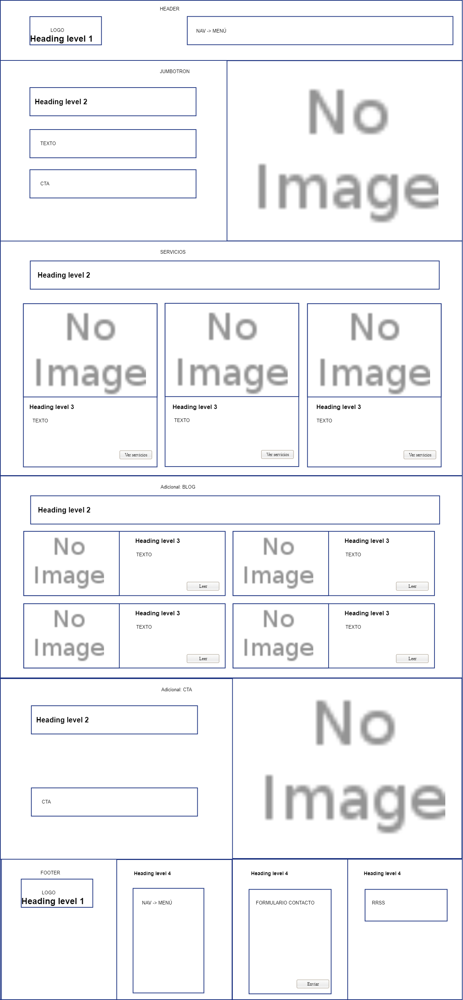
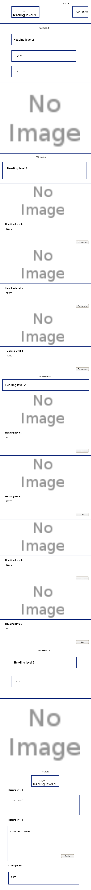

# PROJECT 1: BUSINESS LANDING PAGE
## TOPICS
* [1. Introduction](#1-Introduction)
* [2. Characteristics](#2-Characteristics)
* [3. Sections](#3-Sections)
* [4. Wireframe](#4-Wireframe)
* [5. Website](#5-Website)

## 1. Introduction

This is the first project created for Bootcamp Full Stack with JavaScript.

The project consists of creating a landing page for a business, in this case, a personal business that will start this year.

## 2. Characteristics
It is a static website using HTML5 and CSS3, including Flexbox techniques, CSS Grids, and Responsive Web Design. The IDE is Visual Studio Code.

Other tools such as bootstrap are not used, in this way everything related to responsive is generated manually considering the view from a computer screen, tablet and smartphone.

## 3. Sections

- **a. Header**
    
    This space will contain the name of the company and the main navigation menu.
    
    In the responsive view, the navigation menu is dropdown.
    
 - **b. Jumbotron**
    
    Product presentation section to the user.
    
    Includes title, description and a form to enter name and email.
    
- **c. Services**

    Service catalog presentation section.
    
    Includes image, title, text and link.
    
- **d. Additional: Blog**
    
    Section presenting the most relevant blog news.

    Includes image, title, text and link to full article.
    
- **e. Additional: CTA**    
    
    Call to action section, the user can contact the company for a personalized service.

    Includes image, text and link to contact.

- **f. Footer**

    Section that includes company name, links within the website, contact form and social networks.

## 4. Wireframe

### 4.1 View from computer screen

### 4.1 View responsive screen

## 4. Website

The built website is hosted on netlify: [https://proy01cpanozo.netlify.app/](https://proy01cpanozo.netlify.app/)